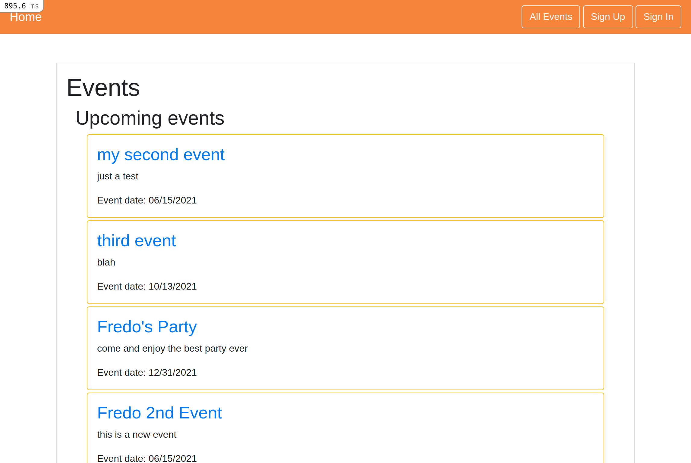

# Members only

> A basic Event manager app, where you can create events, invite other users to your events and see incoming events 
> You can also create a User and Sign-in, Sing-up, or Sing-out.

## Built With

- HTML
- ERB
- SCSS
- Ruby
- JavaScript
- CSS
- Bootstrap
- SQL
- Rspec

### Prerequisites

  Text Editor (VSCode is suggested.)
  Ruby
  Rails
  Rspec
  Bundler
  Yarn
  SQL

## Getting Started

To get a local copy up and running follow these simple example steps:
- Fork this project
- Open your terminal
- Clone this project `git clone git@github.com:helman101/private-events.git`
- Go to the project folder `cd private-events`

### Install

- Run `bundle install`
- Migrate de database `rails db:migrate`
- generate devise `rails generate devise:install`
- generate rspec `rails generate rspec:install`

### Run tests

- Run `rails s`  or  `rails server`
- Now go to  http://localhost:3000
- You will se the project working! 

## Authors

👤 **Andres Ortegon**

- Github: [@helman101](https://github.com/helman101)
- Twitter: [@Helman1011](https://twitter.com/Helman1011)
- Linkedin: [Linkedin](https://www.linkedin.com/in/helman101/)

## 🤝 Contributing

Contributions, issues and feature requests are welcome! Start by:

- Forking the project
- Cloning the project to your local machine
- `cd` into the project directory
- Run `git checkout -b your-branch-name`
- Make your contributions
- Push your branch up to your forked repository
- Open a Pull Request with a detailed description to the development branch of the original project for a review

## Show your support

Give a ⭐️ if you like this project!

## 📝 License

This project is [MIT](LICENSE) licensed.
